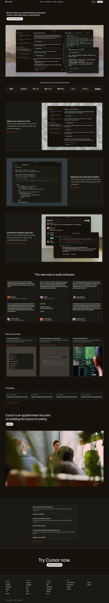

Cursor Landing Page Clone

Hey folks 👋

This repository contains a clone of the Cursor landing page, built from scratch along with all supporting resources.

⏱️ Time Invested: 12+ hours

Tech Stack

HTML5 – written using semantic elements for clarity and accessibility

CSS3 – custom styling with a detailed, component-focused approach

Netlify – used for deployment and live hosting

What I Focused On

Carefully explored and replicated color schemes and visual resources

Used semantic HTML throughout for better structure and maintainability

Followed a clear and meaningful class-naming convention for readability

Challenges Faced

⏳ Time-bound development: completing the entire layout within a tight timeframe while maintaining code quality

🎨 Long CSS files: managing large stylesheets without a framework required careful organization

🧱 Pure HTML & CSS: no libraries or frameworks were used, which meant manually handling layout, spacing, and responsiveness

[Cursor Page Live ↗](https://cursorhayat.netlify.app/)

## Preview

